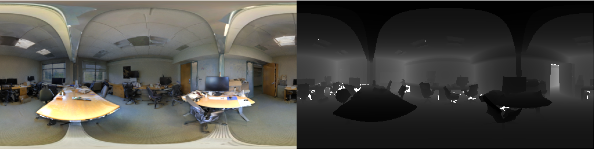
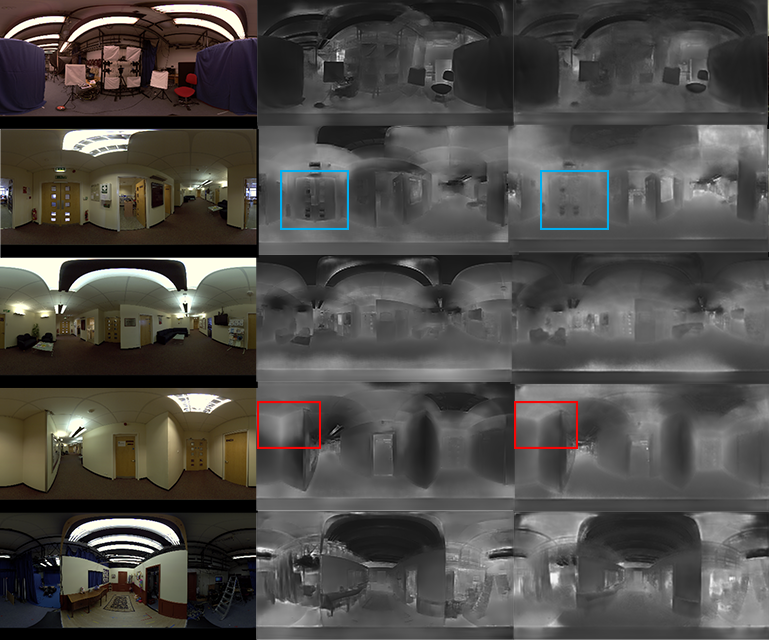

# Depth Estimation for a Single Omnidirectional Image with Reversed-gradient Warming-up Thresholds Discriminator

This is for ICASSP submission


## Dataset

Download the 3D60 depth dataset from https://vcl3d.github.io/3D60/ 
```
@inproceedings{zioulis2018omnidepth,
	title={Omnidepth: Dense depth estimation for indoors spherical panoramas},
	author={Zioulis, Nikolaos and Karakottas, Antonis and Zarpalas, Dimitrios and Daras, Petros},
	booktitle={Proceedings of the European Conference on Computer Vision (ECCV)},
	pages={448--465},
	year={2018}
}
```

### Data Exploration

The CG images are from SunCG, and two different office-scene-based real-world 360 image datasets of two different buildings from Stanford2D3D. These datasets contain 512 $\times$ 256 resolution RGB images of indoor scenes with corresponding depth maps in metres. The real-world ground truth depth maps contain outliers caused by missing depth pixels. In order to improve the training efficiency, the scenes containing over 5% outliers are removed. After the pre-processing, SunCG contains 2319 scenes. Stanford2D3D area5 contains 82 scenes, and area6 contains 132 scenes. 


Figure above shows sampled scenes of the SunCG dataset. They illustrate RGB images and corresponding depth maps of indoor scenes that are simulated and rendered by computers. SunCG contains different scenes that cover a variety of objects that might exist in the real world, such as beds, ladders, fans, etc. In some scenes, it also includes simulated humans. 



However, there are some differences between these CG and real-world scenes, including the textures and colours of the scenes. Figure above shows the real-world scenes from the Stanford2D3D dataset, which are taken in different buildings. It also includes many images, but they are from very limited kinds of scenes. 


## Performance on New Dataset



The figure above shows real-world images captured in a building with an off-the-shelf omnidirectional camera. Though there is no ground-truth depth data, it can be observed that the estimated depth maps show the correct depth of the scenes with smooth changes within objects. Compared with the results from AdaBins, the proposed method shows better depth estimation for the planar ceiling regions in all test images. As AdaBins are affected by textures and lighting conditions, the saturated areas by the lighting in the ceiling show the wrong depth, while the proposed RWTD produced smooth and planar ceiling regions learned from scenes in the source domain.  


## Install

Check https://pytorch.org/ and choose a suitable version of PyTorch for your computers/servers

```
pip install opencv-contrib-python
```

## Train
### complete the argumentparser (fill with absolute path)

The default parameters have been set except:
--filenames_file: source domain dataset (.txt file)
--filenames_file_eval: target domain dataset (.txt file)


### start training 
```
python train_DA_RWTD.py --bs 16 --epochs 100 --comments your_comments
```


### Appendix

<table align="center" style="width:100%; border:#000 solid; border-width:1px 0">
<caption>Table 1: Overfitted model</caption>
<thead style="border-bottom:#000 1px solid;">
<tr>
<th style="border:0">Testing Dataset</th>
<td style="border:0">a1</td>
<td style="border:0">a2</td>
<td style="border:0">a3</td>
<td style="border:0">rel</td>
<td style="border:0">rms</td>
<td style="border:0">log10</td>
</tr>
</thead>
<tr>
<th style="border:0">SUNCG Training</th>
<td style="border:0">0.9868</td>
<td style="border:0">0.9976</td>
<td style="border:0">0.9993</td>
<td style="border:0">0.0344</td>
<td style="border:0">0.2316</td>
<td style="border:0">0.0150</td>
</tr>
<tr>
<th style="border:0">SUNCG Testing</th>
<td style="border:0">0.9451</td>
<td style="border:0">0.9844</td>
<td style="border:0">0.9949</td>
<td style="border:0">0.0547</td>
<td style="border:0">0.3705</td>
<td style="border:0">0.0244</td>
</table>

For example, RectNet was trained with SUNCG training dataset and tested with SUNCG training and testing datasets, respectively. The result of it with LR=0.0001 and a1=0.3651 for the real-world dataset is shown in Table 1. 


## Notice

The encoder-decoder framework is based on 

```
@article{alhashim2018high,
	title={High quality monocular depth estimation via transfer learning},
	author={Alhashim, Ibraheem and Wonka, Peter},
	journal={arXiv preprint arXiv:1812.11941},
	year={2018}
}
```
